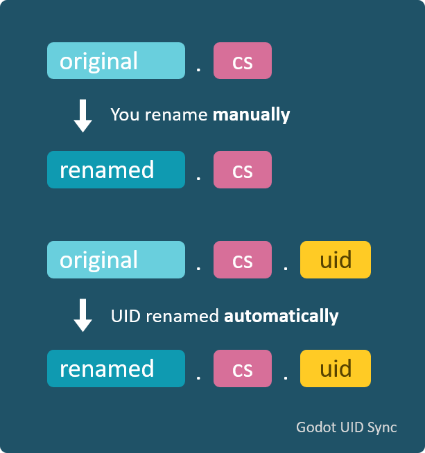

[English](https://github.com/masatoko/godot-uid-sync/blob/main/README.md) | [日本語](https://github.com/masatoko/godot-uid-sync/blob/main/README-ja.md)

# Godot UID Sync（日本語版）

**Godot UID Sync** は、Godot のリソースファイル（例：`.tscn`、`.gd`、`.cs`、`.gdshader` など）をリネームまたは移動した際に、対応する `.uid` ファイルを自動的に同期する Visual Studio Code 拡張機能です。これにより、Godot プロジェクトでの参照の破損を防ぎ、`.uid` ファイルとアセットの整合性を保ちます。



## 主な機能

* Godot リソースファイルと一緒に `.uid` ファイルを自動的にリネームまたは移動します。
* `project.godot` ファイルが存在する場合のみアクティブになるように設定可能。
* 特定のファイルタイプを同期から除外可能。
* `.uid` や `.meta` など、連動させる拡張子をカスタマイズ可能。
* ログ出力の詳細度や表示タイミングを設定可能。

## 推奨設定

ファイルエクスプローラーの煩雑さを避けるため、VS Code の `settings.json` に以下を追加して `.uid` ファイルを非表示にすることを推奨します：

```json
"files.exclude": {
  "**/*.uid": true
}
```

## 拡張機能の設定

この拡張機能には以下の設定オプションがあります：

* `godotUidSync.enabledOnlyInGodotProjects`（boolean、初期値：`false`）

  * `project.godot` が存在するワークスペースでのみ有効化。

* `godotUidSync.excludeExtensions`（string 配列、初期値：`[]`）

  * 同期から除外するファイル拡張子（例：`.png`）。ドットを含める必要があります。

* `godotUidSync.linkedExtensions`（string 配列、初期値：`[".uid"]`）

  * 同期対象とする拡張子のリスト。

* `godotUidSync.revealOutputOnInfo`（boolean、初期値：`true`）

  * 情報メッセージ時に出力パネルを表示。

* `godotUidSync.revealOutputOnWarn`（boolean、初期値：`true`）

  * 警告時に出力パネルを表示。

* `godotUidSync.revealOutputOnError`（boolean、初期値：`true`）

  * エラー時に出力パネルを表示。

* `godotUidSync.showVerbose`（boolean、初期値：`true`）

  * 詳細な内部ログとヒントを表示。
